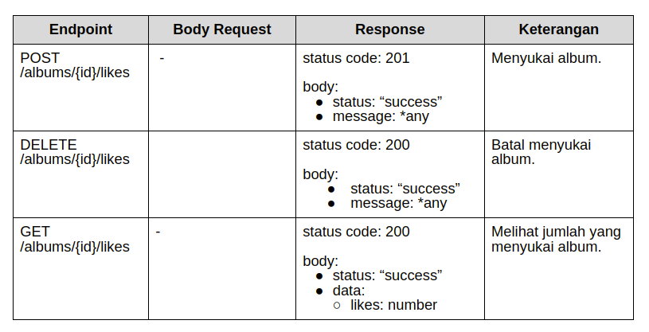

# Proyek OpenMusic API versi 3

Dokumen ini menjelaskan 4 kriteria utama yang harus dipenuhi dalam membuat proyek OpenMusic API versi 3.

## Kriteria 1: Ekspor Lagu Pada Playlist

API harus menyediakan fitur ekspor lagu pada playlist melalui route berikut:

### Endpoint
- **Method**: POST
- **URL**: `/export/playlists/{playlistId}`

### Body Request
```json
{
    "targetEmail": "string"
}
```

### Ketentuan
- Wajib menggunakan message broker dengan RabbitMQ
- Nilai host server RabbitMQ menggunakan environment variable `RABBITMQ_SERVER`
- Hanya pemilik playlist yang boleh mengekspor lagu
- Data yang dikirimkan dari producer ke consumer hanya `PlaylistId` dan `targetEmail`
- Wajib mengirimkan program consumer
- Hasil ekspor berupa data JSON
- Dikirimkan melalui email menggunakan nodemailer
- Kredensial email menggunakan environment variables:
  - `SMTP_USER` - Username email pengirim
  - `SMTP_PASSWORD` - Password email pengirim
  - `SMTP_HOST` - Host server SMTP
  - `SMTP_PORT` - Port server SMTP

### Response
**Status Code**: 201
```json
{
    "status": "success",
    "message": "Permintaan Anda sedang kami proses"
}
```

### Struktur Data JSON yang Diekspor
```json
{
    "playlist": {
        "id": "playlist-Mk8AnmCp210PwT6B",
        "name": "My Favorite Coldplay Song",
        "songs": [
            {
                "id": "song-Qbax5Oy7L8WKf74l",
                "title": "Life in Technicolor",
                "performer": "Coldplay"
            },
            {
                "id": "song-poax5Oy7L8WKllqw",
                "title": "Centimeteries of London",
                "performer": "Coldplay"
            },
            {
                "id": "song-Qalokam7L8WKf74l",
                "title": "Lost!",
                "performer": "Coldplay"
            }
        ]
    }
}
```

## Kriteria 2: Mengunggah Sampul Album

API harus dapat mengunggah sampul album melalui route berikut:

### Endpoint
- **Method**: POST
- **URL**: `/albums/{id}/covers`

### Body Request (Form data)
```
{
    "cover": file
}
```

### Ketentuan
- Tipe konten yang diunggah harus merupakan MIME types dari images
- Ukuran file cover maksimal 512000 Bytes
- Dapat menggunakan File System (lokal) atau S3 Bucket
- Untuk S3 Bucket, gunakan environment variables:
  - `AWS_BUCKET_NAME` - Nama bucket
  - `AWS_REGION` - Region AWS
  - `AWS_ACCESS_KEY_ID` - Access Key ID
  - `AWS_SECRET_ACCESS_KEY` - Secret Access Key

### Response
**Status Code**: 201
```json
{
    "status": "success",
    "message": "Sampul berhasil diunggah"
}
```

### Response GET /albums/{id}
Endpoint GET `/albums/{id}` harus menampilkan properti `coverUrl`:

```json
{
    "status": "success",
    "data": {
        "album": {
            "id": "album-Mk8AnmCp210PwT6B",
            "name": "Viva la Vida",
            "coverUrl": "http://...."
        }
    }
}
```

### Ketentuan Tambahan
- URL gambar harus dapat diakses dengan baik
- Bila album belum memiliki sampul, maka `coverUrl` bernilai `null`
- Bila menambahkan sampul pada album yang sudah memiliki sampul, maka sampul lama akan tergantikan

## Kriteria 3: Menyukai Album

API harus memiliki fitur menyukai, batal menyukai, serta melihat jumlah yang menyukai album.

### Spesifikasi Endpoint



### Ketentuan
- Menyukai atau batal menyukai album merupakan resource strict sehingga dibutuhkan autentikasi
- Hal ini bertujuan untuk mengetahui apakah pengguna sudah menyukai album
- Pastikan pengguna hanya bisa menyukai album yang sama sebanyak 1 kali
- Kembalikan response code 400 jika pengguna mencoba menyukai album yang sama

## Kriteria 4: Menerapkan Server-Side Cache

Menerapkan server-side cache pada jumlah yang menyukai sebuah album (GET `/albums/{id}/likes`).

### Ketentuan
- Cache harus bertahan selama 30 menit
- Respons dari cache harus memiliki custom header `X-Data-Source` bernilai `"cache"`
- Cache harus dihapus setiap kali ada perubahan jumlah like pada album dengan id tertentu
- Memory caching engine wajib menggunakan Redis atau Memurai (Windows)
- Nilai host server Redis menggunakan environment variable `REDIS_SERVER`

## Kriteria 5: Pertahankan Fitur OpenMusic API versi 2 dan 1

Pastikan fitur dan kriteria OpenMusic API versi 2 dan 1 tetap dipertahankan:

- Pengelolaan Data Album
- Pengelolaan Data Song
- Fitur Registrasi dan Autentikasi Pengguna
- Pengelolaan Data Playlist
- Menerapkan Foreign Key
- Menerapkan Data Validation
- Penanganan Error (Error Handling)

---

*Dokumentasi ini dibuat berdasarkan spesifikasi OpenMusic API versi 3*